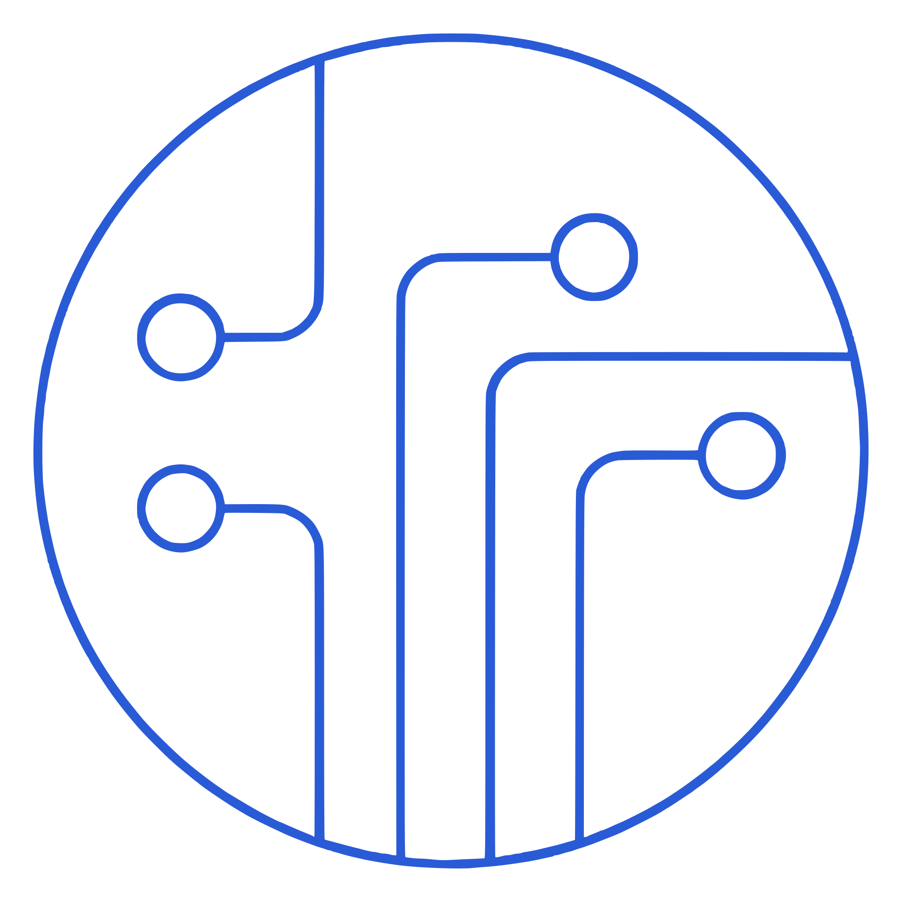

<div align="center">



# INFRA-W

**Infrastructure Workspace**

Self-hosted browser access to SSH, RDP and VNC, with file management, snippets and scripts,<br>
NetBox and Proxmox integration, and a complete audit trail.

[Quick start](#quick-start) • [Features](#features) • [Documentation](#documentation) • [Licensing](#licensing)

</div>

<picture>
  <source media="(prefers-color-scheme: dark)" srcset="docs/assets/screenshots/workspace-dark.png">
  
</picture>

## Features

- **Remote access in the browser:** SSH and Telnet terminals, RDP and VNC desktops in tabs. Sessions keep running while you switch pages, can be paused and resumed, opened in a separate window or shared read-only or read-write.
- **Inventory:** organizations, folders and hosts with identities (passwords or SSH keys) and tags. Search by name, IP address, protocol, operating system or tag.
- **File manager:** browse, upload, download and edit files over SFTP. The file manager, previews and editors are movable windows, so two files can be compared side by side next to the terminal; images can be zoomed. The address bar suggests folders (hidden ones included) and opens a pasted file path directly.
- **Snippets and scripts:** reusable commands and interactive scripts, filtered by the [detected operating system](docs/os-detection.md) of each host.
- **Integrations:** keep hosts in sync with NetBox; import and control Proxmox VE VMs and containers.
- **Sign-in:** local accounts with TOTP and passkeys, LDAP with FreeIPA and Active Directory presets, OIDC single sign-on.
- **Organizations and audit:** shared hosts and credentials per team, an audit log of connections and changes, optional session recording with replay, and required connection reasons.
- **Operations:** scheduled backups to local storage, SMB or WebDAV with restore; light, dark and OLED themes; five interface languages.

<table>
  <tr>
    <td></td>
    <td></td>
  </tr>
  <tr>
    <td></td>
    <td></td>
  </tr>
</table>

More in the [screenshot gallery](docs/screenshots.md).

## Quick start

INFRA-W runs as one container.

```sh
mkdir -p /opt/infra-w
openssl rand -hex 32        # the encryption key for stored credentials

podman run -d \
  --name infra-w \
  --network host \
  --restart always \
  -e ENCRYPTION_KEY="<generated-key>" \
  -v /opt/infra-w:/app/data:Z \
  swissmakers/infra-w:latest
```

Open `http://<host>:6989` and create the first administrator. Keep the encryption key in your secrets store: backups do not contain it. Docker, Compose, upgrades and hardening are covered in the [installation guide](docs/installation.md); for production put INFRA-W behind a [TLS reverse proxy](docs/reverse-proxy.md) and set `TRUST_PROXY=1`.

## Configuration

INFRA-W is configured with a few environment variables: `ENCRYPTION_KEY` (required), the ports, `TRUST_PROXY`, `STRICT_TLS` and `LOG_LEVEL`. They are listed in the [installation guide](docs/installation.md#configuration). Sign-in session lifetime and audit retention are set in the application, see [Users and sign-in](docs/administration.md).

## Documentation

| Setup | Using INFRA-W | Administration |
|---|---|---|
| [Installation](docs/installation.md) | [Workspace](docs/workspace.md) | [LDAP](docs/ldap.md) |
| [Reverse proxy](docs/reverse-proxy.md) | [Integrations](docs/integrations.md) | [OIDC / SSO](docs/oidc.md) |
| [SSL/HTTPS](docs/ssl.md) | [Organizations and audit](docs/organizations-and-audit.md) | [Backup and restore](docs/backup.md) |
| [Screenshots](docs/screenshots.md) | [Scripts and snippets](docs/scripts&snippets.md) | [Users and sign-in](docs/administration.md) |
| | [Script directives](docs/ScriptingVariables.md) | [API reference](docs/api-reference.md) |
| | [OS detection](docs/os-detection.md) | |

## Development

Requires Node.js 24 and Yarn 1.

```sh
yarn install && (cd client && yarn install)
yarn dev                 # server, client and guacd
yarn lint && yarn build  # lint (server and client, 0 warnings) and production build
yarn test                # server and utility tests
yarn test:ui             # browser smoke test (client on 127.0.0.1:4173)
yarn screenshots         # regenerate the screenshots in this README
```

See [Contributing](docs/contributing.md) for the full workflow and checks. Dependency and image security helpers: `make security-update`, `make security-audit`, `make security-all`, `make security-sbom`.

## Licensing

INFRA-W is source-available under the **PolyForm Noncommercial 1.0.0** license with additional terms from Swissmakers GmbH:

- Private, noncommercial use is free of charge.
- Commercial use requires a commercial license from Swissmakers GmbH.
- Redistribution, third-party support and managed services require written authorization.

See [LICENSE](LICENSE) and [Licensing](docs/licensing.md). INFRA-W's upstream attribution and third-party notices are in [NOTICE](NOTICE).

## Support

Product information, support, commercial licenses and partner authorization: [swissmakers.ch/infra-w](https://swissmakers.ch/infra-w/).
