# Screenshots

All screenshots show the current interface with invented example data (hosts, users and files). They are generated from the same fixtures as the browser tests, see [Regenerating](#regenerating).

## Workspace

The inventory on the left, recent connections and an inventory summary in the overview. Search matches names, IP addresses, protocols, operating systems and tags.

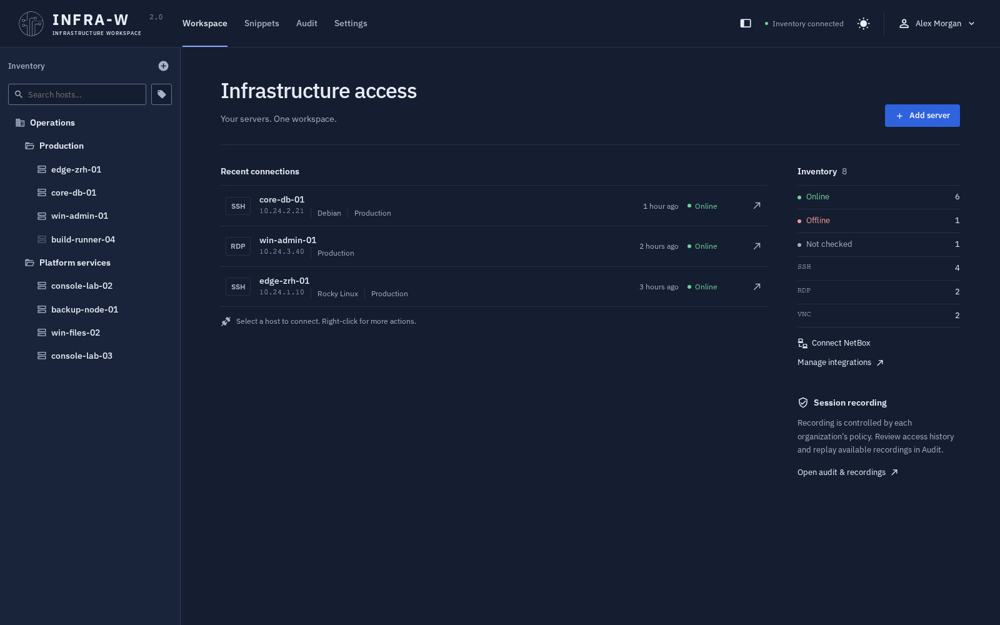

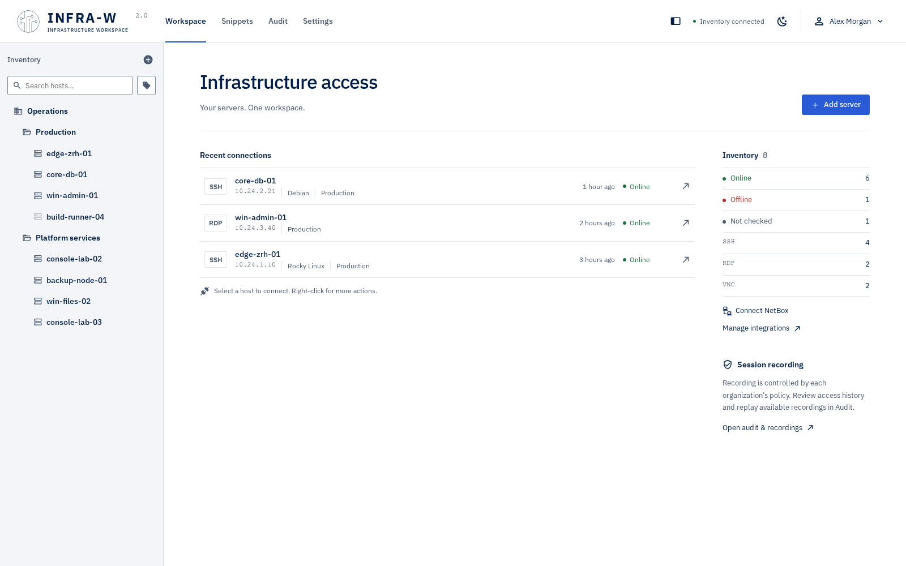

## Terminal

SSH sessions open in tabs and keep running while you switch to Snippets, Audit or Settings.

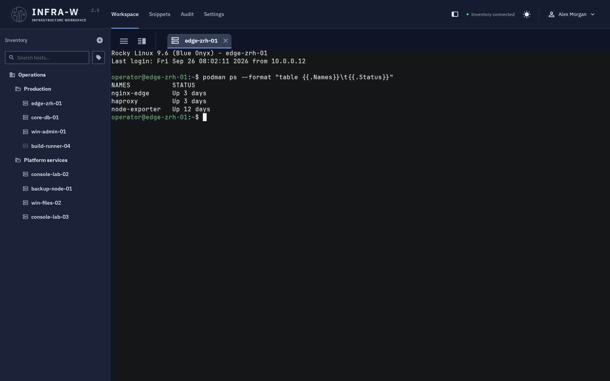

## File manager

Browse and edit files over SFTP. The file manager, previews and editors are movable, resizable windows, so two files can be compared side by side while the terminal stays usable. Images can be zoomed.

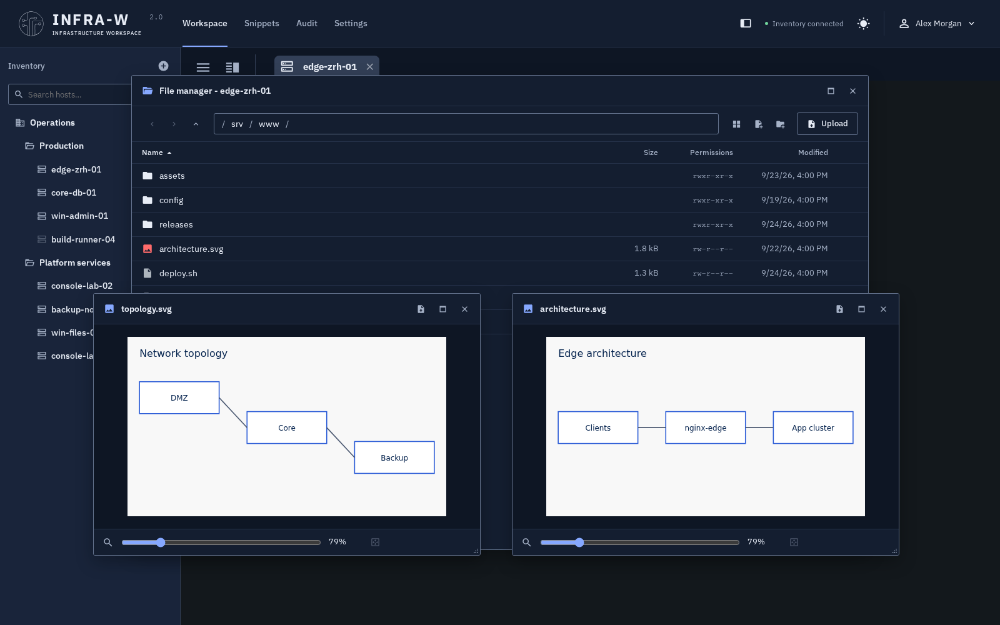

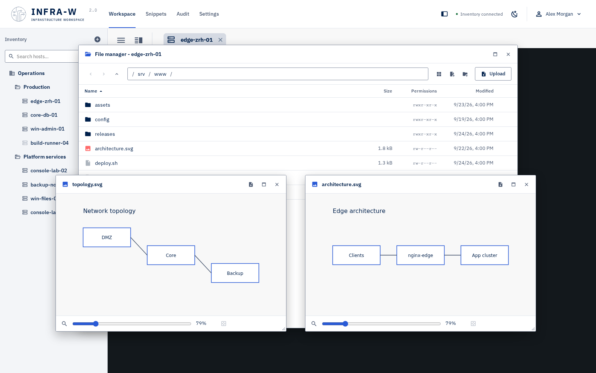

## Snippets

Reusable commands for the terminal, optionally limited to operating systems.

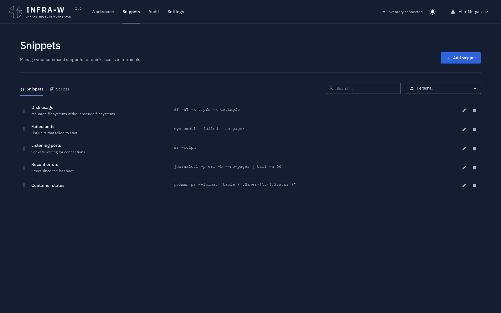

## Audit and recordings

Every connection and change is logged. Recorded SSH and desktop sessions replay in the browser.

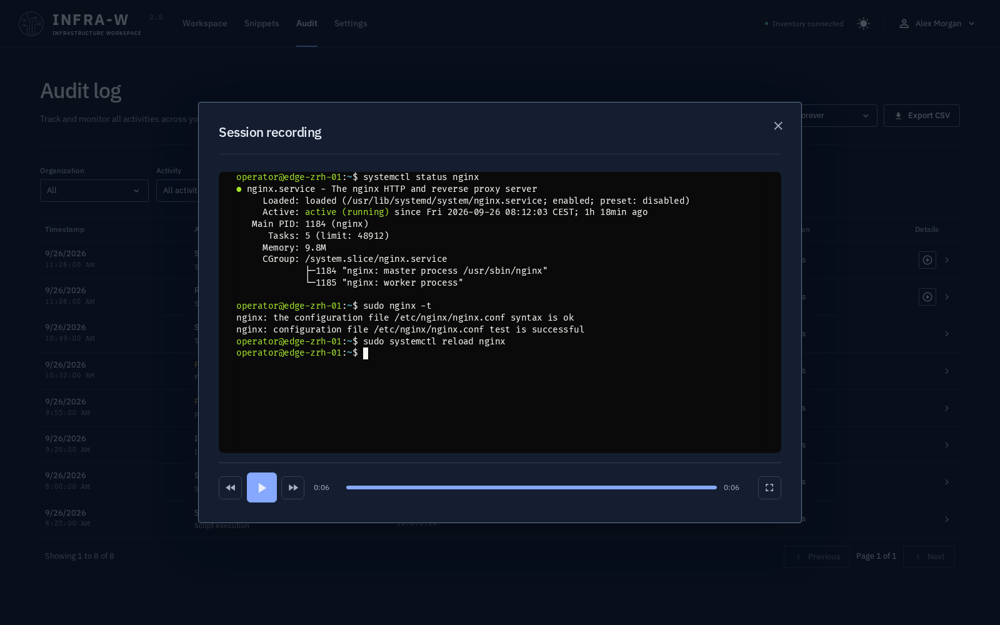

## Settings

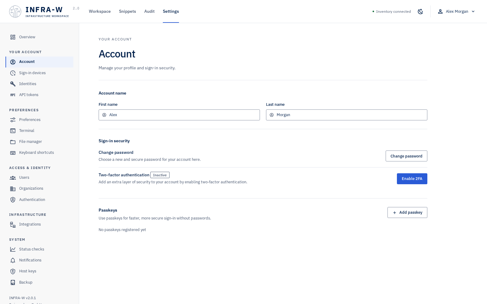

LDAP providers start from a FreeIPA or Active Directory preset:

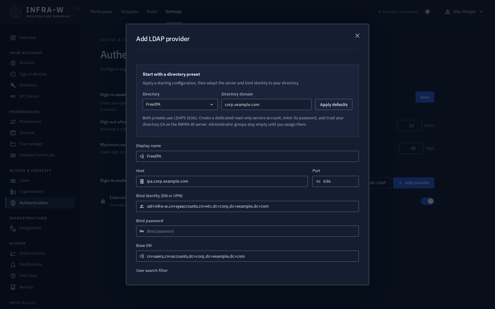

NetBox and Proxmox integrations keep the inventory in sync:

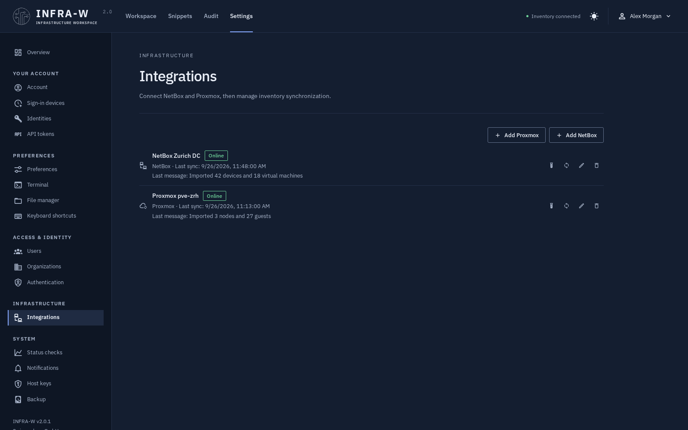

## Sign-in and mobile

The sign-in page follows the light or dark setting of the operating system:

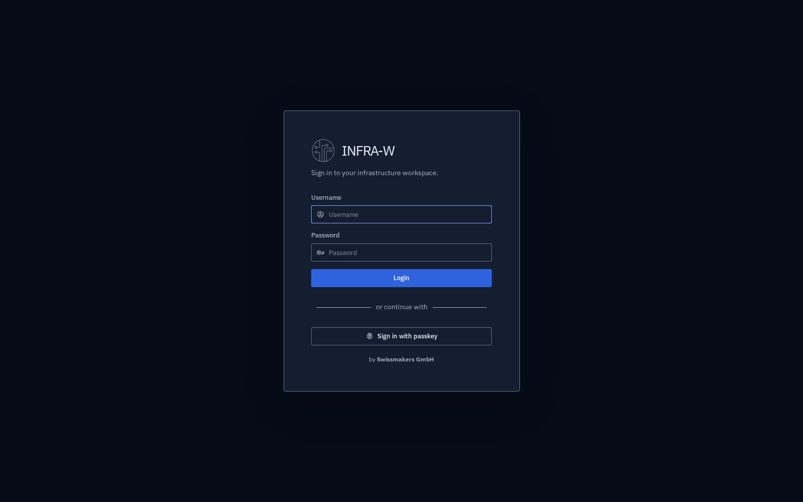

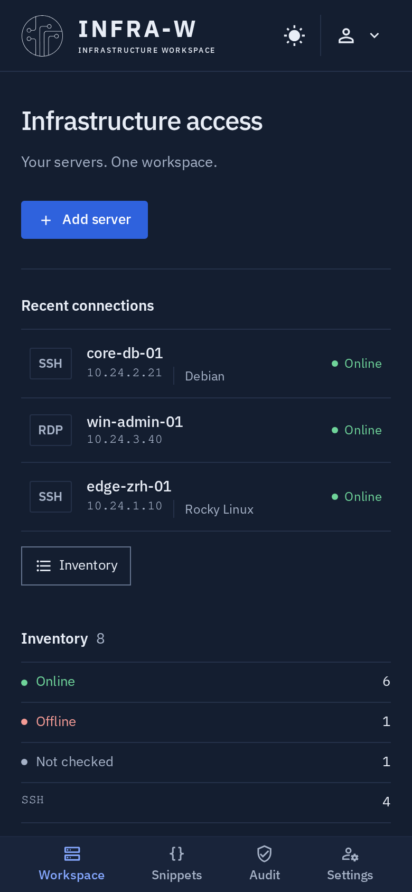

## Regenerating

The screenshots live in `docs/assets/screenshots/` and are used by the README, this documentation and the landing page. After a visible change, regenerate them:

```sh
cd client && yarn dev --host 127.0.0.1 --port 4173   # in a second terminal
yarn screenshots
```

`scripts/screenshots.cjs` drives the real client with the fixtures in `tests/support/ui-fixtures.cjs`, so no server or real infrastructure is contacted. The output is deterministic: running it again without interface changes produces identical files. The script fails if a page reports an error or an image exceeds 300 KB.
